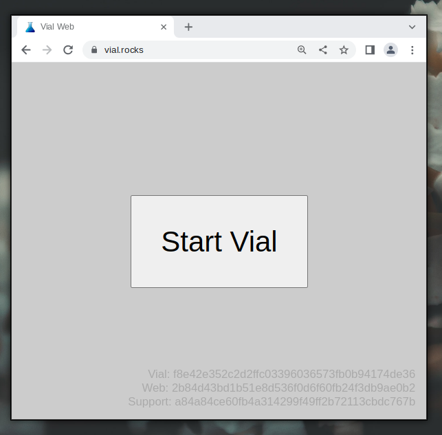
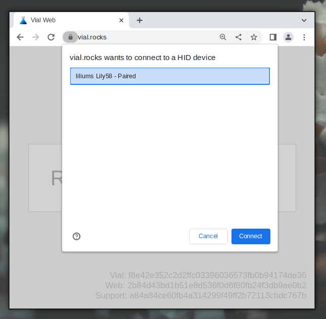
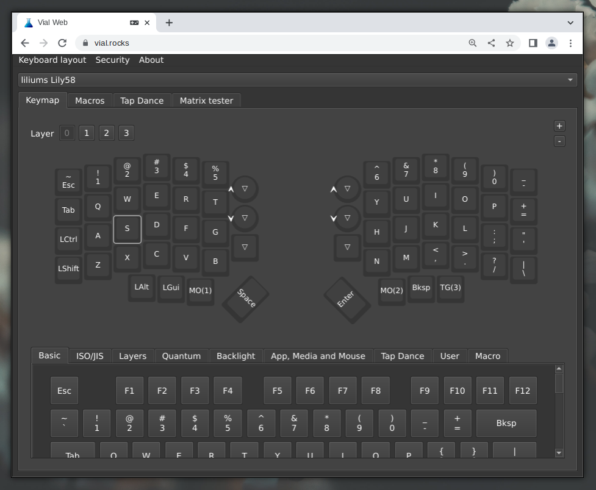
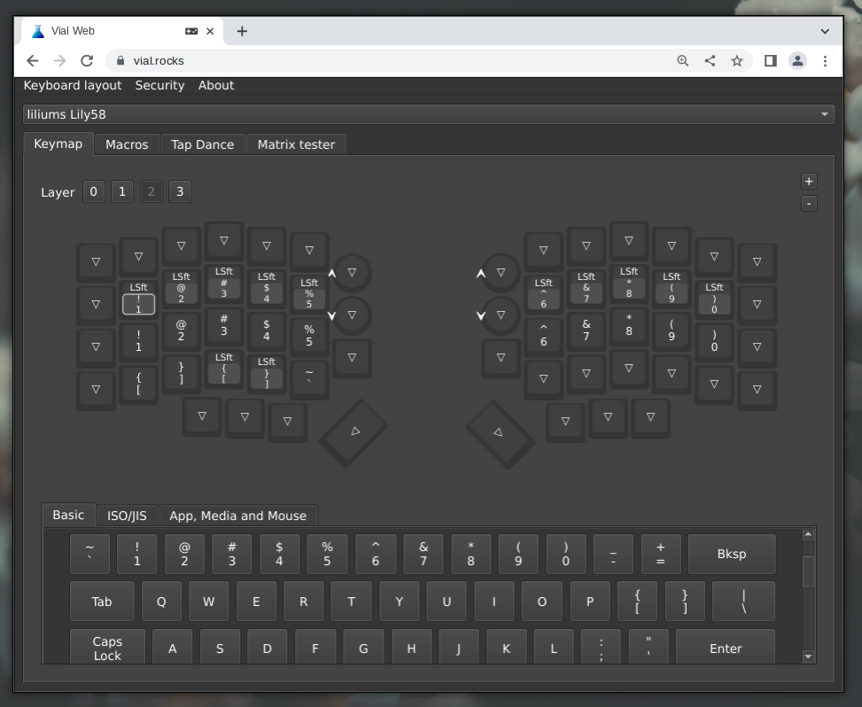

<!--
name: lily58 aftership
peek: 
tags: draft 
date: 1679998160
-->

## Подключение

1. Соедините две половинки с помощью 3.5мм TRRS провода (похожего на двухсторонний провод для наушников).
2. Подключите левую половинку к компьютеру.

Внимание: не разъединяйте половинки включенной клавиатуры! Это может вывести одну из половинок из строя.

## Настройка

1. Запустите браузер на базе Chromium (Google Chrome, Brave или Chromium)
2. Перейдите по ссылке [https://vial.rocks/](https://vial.rocks/) и нажмите *Start Vial*.

3. Выберите клавиатуру в появившемся окне и нажмите *Connect*.

4. Выделите клавишу, которую Вы хотите настроить, а затем выберите ее новое назначение из вкладок внизу окна.

## Слои

Слои работают подобно клавише *Shift* на обычной клавиатуре: простое нажатие на *! 1* выведет единицу, а *Shift* и *! 1* вместе -- восклицательный знак.

Переключение между слоями происходит с помощью *MO(n)* и *TG(n)* из вкладки *Layers*. *MO(n)* работает как *Shift*: слой *n* активен пока клавиша удерживается, а нажатие на *TG(n)* включает слой *n* подобно *Numlock*. Повторное нажатие на *TG(n)* выключает слой *n*.

## Дополнительные функции

Чтобы назначить сочетание клавиш (например, *Shift+1*), выделите клавишу, перейдите во вкладку *Quantum* и выберите *LSft (kc)*. Выделите светло-серый прямоугольник внутри клавиши, а затем выберите *! 1* из вкладки *Basic*.

Нажатие на настроенную клавишу выведет восклицательный знак в текстовое поле. Данная функция крайне удобна при создании слоя с символами.

## FAQ

> Вы обещали исходники прошивки.

Напишите мне личное сообщение и я отправлю Вам ссылку.

> Как включить NKRO (N-Key Rollover)?

NKRO включен по умолчанию в самой прошивке.
