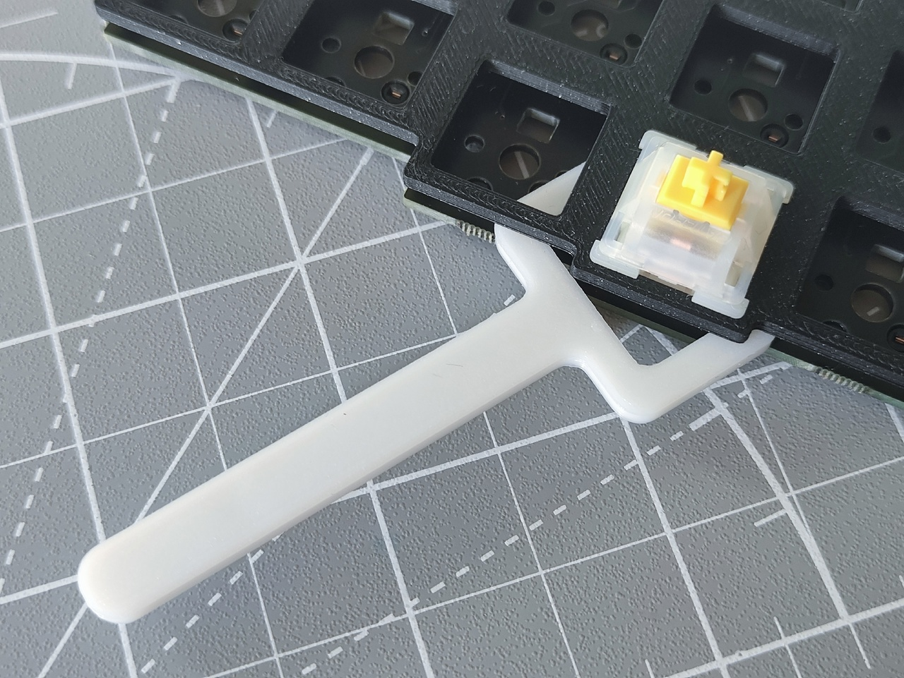

- Мой канал в Телеграм: [oumae_mk](https://t.me/+bHgaMW-ajFhkY2Fi)
- По вопросам после покупки, обращайтесь в чат на сайте, где был оформлен заказ.

## Свитчи

1. Положите плату на плоскую поверхность, сокетами вниз. Не вставляйте свитчи в плату, находящуюся в корпусе.
2. Убедитесь, что ноги свитча выпрямлены. При необходимости, выпрямите их с помощью пинцета.
3. *Для МХ свитчей:* используйте плейт-вилку (линейку или любой другой пластиковый/деревянный шим толщиной 1.6-1.9мм), чтобы удержать плейт на месте и сделать процесс проще.
    

    
Спойлер <i>(клик чтобы раскрыть)</i>

     
    
    
    
    

  
4. Не применяйте грубую силу, это может привести к поломке сокета.

## Подключение

1. Соедините две половинки с помощью 3.5мм TRRS провода (похожего на двухсторонний провод для наушников). Убедитесь, что коннекторы вставлены до конца. 
2. Подключите левую половинку к компьютеру с помощью кабеля, поддерживающего передачу данных. 

Не соединяйте/разъединяйте половинки включенной клавиатуры!

## Настройка

1. Запустите браузер на базе Chromium (Google Chrome, Brave или Chromium).
2. Перейдите по ссылке [https://usevia.app/](https://usevia.app/).
3. Если перед Вами не появилась раскладка клавиатуры, нажмите *Authorise Device*, выберите клавиатуру во всплывающем окне и нажмите *Подключение*.
4. Выделите клавишу, которую Вы хотите настроить, а затем выберите ее новое назначение из вкладок внизу окна. Изменения применятся сразу же.

## Слои

Слои определяют, что сделает нажатие на данную клавишу. Их можно сравнить с тем, как работают `Shift` и `Numlock` на обычной клавиатуре. Настроить слой можно выбрав соответствующее число в левом верхнем углу окна Via.

По умолчанию, активен слой `0`. Основными способами переключения между слоями являются `MO(n)` и `TG(n)`. Их можно найти во вкладке *Layers*.

- `MO(n)` работает как `Shift`: слой *n* активен пока клавиша удерживается.
- `TG(n)` активирует слой *n*. Повторное нажатие на `TG(n)` выключает слой *n*. 

## Дополнительные функции

Популярные сочетания клавиш (например, `Shift` + `!1`), доступны во вкладке *Special*. Они крайне удобны в создании слоя с символами.

`Any` из вкладки *Special* позволяет вручную использовать (почти) любой keycode, поддерживаемый QMK. Например, `LCTL(KC_A)` назначит сочетание `Ctrl+A` на выделенную клавишу. 

С подробным списком можно ознакомиться в документации QMK: [https://docs.qmk.fm/#/keycodes](https://docs.qmk.fm/#/keycodes).

